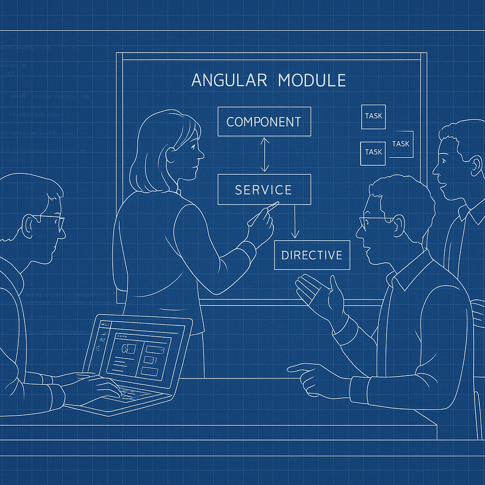

# Daily Status - Tuesday - 2025-06-03
If you would like to stop receiving these updates, reply with 'unsubscribe'.

## Specific Team: Angular Coaching
Today, we worked with the Specific Team Name team on creating a new module for their Angular site. We ran an impromptu two and a half hour ensemble coaching session, helping a team of three—including a new member—build a page from Figma documentation. We explored using AI to generate CLI commands, and when SonarQube blocked our commit due to a longstanding bug, we found a workaround by disabling the "no sonar" rule at the line level.

The session surfaced several surprises: AI tools are technically available but only on Macs, which the team doesn't have. Their manual testing workflow is slow, and this was their first time testing the opening of a modular window. The team was happy by the end, bonded well, and showed great energy and eagerness to learn.

## Big-picture value:

* The session enabled stronger collaboration and onboarding.
* Addressed a technical blocker that had been ignored.
* Highlighted the need for better clarity on AI tool access.
